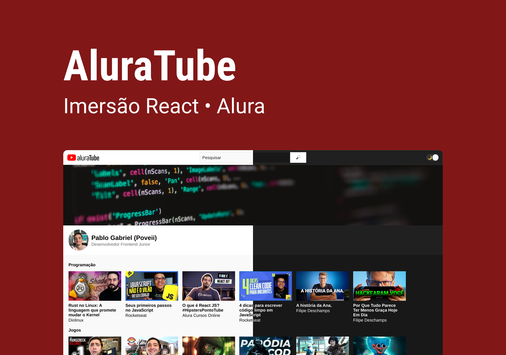

<h1 align="center"> Imersão React </h1>

  Evento exclusivo e gratuito, promovido pela Alura para ensino da biblioteca React.

  <a href="#-tecnologias">Tecnologias</a>&nbsp;&nbsp;&nbsp;|&nbsp;&nbsp;&nbsp;
  <a href="#-projeto">Projeto</a>&nbsp;&nbsp;&nbsp;|&nbsp;&nbsp;&nbsp;
  <a href="#-deploy">Deploy</a>&nbsp;&nbsp;&nbsp;|&nbsp;&nbsp;&nbsp;
  <a href="#-layout">Layout</a>&nbsp;&nbsp;&nbsp;|&nbsp;&nbsp;&nbsp;
  <a href="#memo-licença">Licença</a>

  

 

  

## 🚀 Tecnologias

Esse projeto foi desenvolvido com as seguintes tecnologias:

- JavaScript e JSON
- [Node e NPM](https://nodejs.org/)
- [React](https://reactjs.org/)
- [NextJS](https://nextjs.org/)
- [Styled Components](https://styled-components.com/)
- [Supabase](https://supabase.com/)

## 💻 Projeto

Descrição do projeto

## ✈️ Deploy

Hospedado na Vercel, plataforma que foi recomendada no evento. [Aqui o link!](https://aluratube-poveii.vercel.app/)

## 🔖 Layout

Você pode visualizar o layout do projeto através [DESSE LINK](https://www.figma.com/file/1acrju7CLwHkSh6e7xEk9h/Aluratube/duplicate). É necessário ter conta no [Figma](https://figma.com) para acessá-lo.

## :memo: Licença

Esse projeto está sob a licença MIT.

---

Feito com 💜 e ⚡ by Poveii
